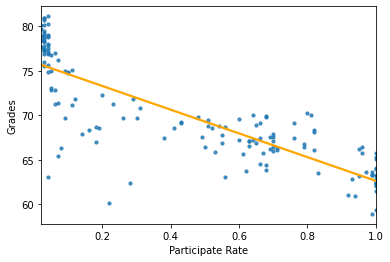
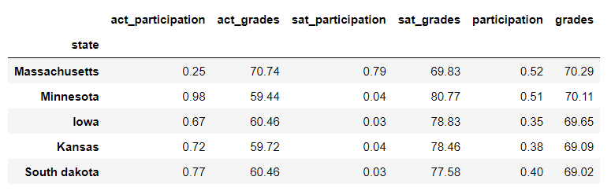
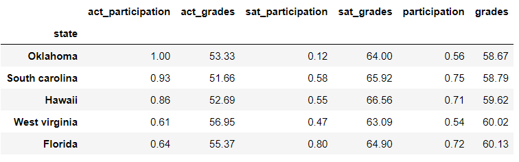

#  Project 1: Standardized Test Analysis

### Overview

Adding on to the history of standardized tests. Since 2002, standardized tests have been mandated in all 50 US states. However, there are alot of arguments or studies debating that standardized tests only identify which students are good at taking tests but does not have meaningful measure of progress or performance. Some states/colleges have even stopped mandating standardized tests for evaluation due to the discovery of significant mismatch between what’s taught and what’s tested. Critics also say that the tests are too easily gamed by students who can pay thousands of dollars for private coaching and test prep.

### Problem Statement

By looking at the data on SAT & ACT result by US states from 2017 to 2019, we are able to see not every states has 100% participation rate for both SAT/ACT tests which was due to the decision to drop the mandate of the standardized tests.
With that regard, we are able to observe the bia-ness between the average grade and the participation rate by looking at the graph plotted. 
  
we can see from the scatter graph with the correlation coefficient, it is relatively negative correlated between the average grades and participation rate. In other word, the higher the participation rate, the lower the average SAT/ACT grades that the state has. This is because the raw SAT / ACT scores are terribly confounded with participation rates. The reason is simple, the best students in any state tend to be the most aggressive and driven about wanting to score for the test. Therefore, if a state’s participation rate is low, it means that the state did not mandate the standardized test and only motivated and driven students are taking the test, it will nevertheless drive the average grades artificially high and this barely qualify as an indicator for having a good educational system of the states. In contrast, if the state has 100% or high participation rate, this indicates that every students have been forced to take the test, so even students that do not have the interest for taking the tests will bring down the average grade of the state drastically.  
 
 
Next, we take a look at the top 5 states and bottom 5 states based on the average grades to further illustrate our findings from the scatter graph. Looking at top 5 states, the participation rate range from 35% to 52%, whereas bottom 5 states range from 54% to 75% of participation rate which is consistent with the interpretation from the scatter graph. Thus, what can the governers do to motivate students and empower students to take the test willingly without enforcement.

### Suggestion and Conclusion

**Economically:**
- More education expenditure should be allocated especially to those districts
with less than 10,000 USD
- On the short term, more resources should be allocated to lower income families
such as subsidies, bursaries or grants  
**Ethnically:**
- More help should be focused on Hispanic/Latino as well as Black Americans
- Over time, as results among these groups increase, it may help to counter
existing stereotypes these groups cannot perform well in these tests
- investigate what Asian American families are doing right to achieve higher
standardized score  
**Broadband Access:**
- provide subsidized broadband services to areas with low broadband penetration
so that they will have access to education resource  
**Household type:**
- Increase provision of counselling and after school care to areas with lower
percentage of married households  
**Geographical:**
- Focus help on town and rural areas, especially inland areas

In the nutshell, Admission base on standardized scores should not perpetuate existing inequality in society.

### Datasets

#### Provided Data

* [`act_2017.csv`](./data/act_2017.csv): 2017 ACT Scores by State ([source](https://blog.prepscholar.com/act-scores-by-state-averages-highs-and-lows))
* [`act_2018.csv`](./data/act_2018.csv): 2018 ACT Scores by State ([source](https://blog.prepscholar.com/act-scores-by-state-averages-highs-and-lows))
* [`act_2019.csv`](./data/act_2019.csv): 2019 ACT Scores by State ([source](https://blog.prepscholar.com/act-scores-by-state-averages-highs-and-lows))
* [`sat_2017.csv`](./data/sat_2017.csv): 2017 SAT Scores by State ([source](https://blog.collegevine.com/here-are-the-average-sat-scores-by-state/))
* [`sat_2018.csv`](./data/sat_2018.csv): 2018 SAT Scores by State ([source](https://blog.collegevine.com/here-are-the-average-sat-scores-by-state/))
* [`sat_2019.csv`](./data/sat_2019.csv): 2019 SAT Scores by State ([source](https://blog.prepscholar.com/average-sat-scores-by-state-most-recent))

**Make sure you cross-reference your data with your data sources to eliminate any data collection or data entry issues.**

#### References

https://www.bostonglobe.com/2020/05/01/opinion/colleges-are-making-sat-act-optional-now-will-that-stick/

https://blog.prepscholar.com/average-sat-and-act-scores-by-stated-adjusted-for-participation-rate

https://www.cnbc.com/2019/10/03/rich-students-get-better-sat-scores-heres-why.html
