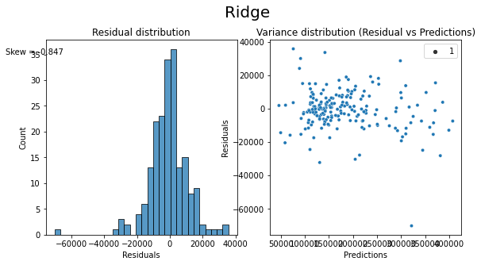

# Ames Housing: A Model for Price Prediction
---

### Preamble
This project aims make use of machine learning for to predict housing prices using the Ames Housing data set, and determine parameters that are most often used in computing the value of a property.

---

### Problem Statement
The focus problem is the value of the house, represented by the Sale Price. The Ames data set has many parameters provided that can either help or distort the predictive model. The problem is which predictive model to be used and how to best use the information provided from the parameters and predict Sale Price with the lowest root mean square error with the references from Kaggle 

A successful outcome would be deriving an approach in treating the parameters and transforming the object variables into usable variables in the predictive model. From there, the best model can be decided on to use for value prediction. There are many models available online, but not all models are used into this analysis, the models that are used in this project to determine the best are Lasso, Ridge and ElasticNet.

### Data Dictionary
The Ames Housing Dataset is an exceptionally detailed and robust dataset with 81 columns of different features relating to houses which include 22 nominal, 23 ordinal, 14 discrete, and 20 continuous variables (and 2 additional observation identifiers)

A detailed description of each variable in the data set can be found [here](http://jse.amstat.org/v19n3/decock/DataDocumentation.txt).

There is one additional parameter engineering along the way

|Feature|Data Type|Data Description|
|:--|:--|:--|
|`Age Sold`|Numerical > 0|Represent the Years sold upon last remodeling/adding|

### Data Cleaning
Observed that there were 20 columns that has null values. Created function to identify numeric columns and string columns. Thereafter, for numeric columns to be filled up with zero and for string columns to be filled up as 'NA'.

### Initial Feature Engineering
Create dummy and function to dump everything into linearRegression model to create a baseline/Null hypothesis for later use.
Baseline score is -0.014 and RMSE is 80,279.17

### Exploratory Data Analysis
**Box plots**
 
The 20 ordinal features plotted above, they seem to have slight or significant impact for the sales price, thus, we will not drop any of the columns. 
**EXCEPT** for 'Lot Shape', 'Land Slope', 'Pool QC' because there are no relative trend or pattern for the price changes

**Correlation** 
 
Dropping nominal columns that have less that 0.05 and more than -0.05 correlations, except for those relevant categorical or date columns

**Outlier**
 
Assumption - with all the plots above, it seems that they are all relevant from slight to significant impact on the sales price. thus, we will remain all these columns.  
**EXCEPT** for 'Screen Porch','Misc Feature','Bldg Type','Kitchen AbvGr', 'Wood Deck SF' and 'Alley' because there are no relative trend or pattern for the price changes  
**Note** - Observed that most of the outliers appears to be more than 450,000 in sales price, thus, decision to filter out sales price that has more than 450,000.

**Emphasis on Outlier**
 
further emphasis on 'Garage Cars','Garage Area','Gr Liv Area','1st Flr SF' to identify the outlier to drop.

**Addition Features**

'Year Built' and 'Year Remod/Add' are significant factors for the price vary as the building gets old, the price will fall, so called the depreciation factor. Thus, converting to both 'Year Built' and 'Year Remod/Add' to age for aggregation purpose. 
<b>Assumption</b> - selling price will be revaluated from 'Year Remod/Add'. Therefore, we will be ignoring 'Year Built'.  
<b>Note</b> - dropping 'Age sold' that is less than zero, assuming price sold was just the price of the land which will be irrelevant to our analysis.
 
 =*= Above graph further proves that the price will fall as age grows =*=

**After dropping Outlier**
 
Decision to drop 'Enclosed Porch' and 'Fence' as there is no significan trend or impact to the Sales Price

### Model Selection and Evaluation
- Based on the cross validation of 4 models (`Linear Regression`, `Lasso`, `Ridge`, and `Elastic Net`), `Ridge` best efficient to eliminate multicollinearity in data models and will be used as the selected model
- Running `Ridge` on the test data reveals a plot of predicted vs actuals as follows
 
- The `Ridge` R2 score is 0.965 and with RMSE of 11,771
- The residuals also follow a normal distribution

### Recommendations & Conclusion

Objectively valuing a property From the findings, it can be concluded that in order to appropriately value a property, the 2 main parameters that should be considered are:

Age sold of the property
Overall quality of the property.

Given that the overall quality is a function of the quality of different aspects of the property, the highest correlated parameters to Overall Qual are:

Exer Qual, which looks at the material and finish of the external facade, implying that first impressions are extremely important
Kitchen Qual, implying that one of the most important aspect of the house it the kitchen
Bsmt Qual, the second most important feature in the house that contributes to the overall quality

Improving the quality of these 3 areas will have the highest impact in the value of their property as these parameters will help increase the overall quality of the house, which has a high correlation to sale price.

### Limitations
The model that used has shown to be rather accurate at predicting properties. However. this model runs on past records and is only as good as how recent the database is. While it may be quite accurate in terms of predicting the value of a property in the next 1 or 2 years, it will not be able to predict the potential value in a long run (5 or more years) for investment purposes.

